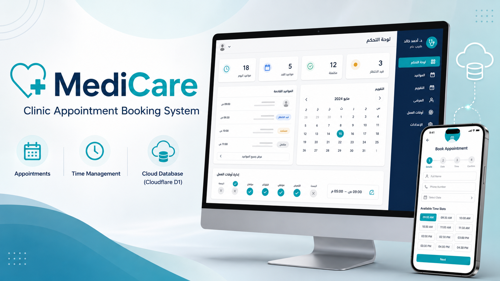

# 🩺 MediCare – Clinic Appointment Booking & Management System

A responsive clinic appointment booking and management system designed to simplify patient scheduling, doctor availability, appointment tracking, and clinic administration.



---

## 📖 Project Overview

**MediCare** is a full-stack clinic management project that provides two main experiences:

- A patient-facing appointment booking interface.
- A doctor/admin dashboard for managing appointments, patients, availability, and clinic activity.

The system is built with **Next.js, React, TypeScript, Tailwind CSS, Cloudflare D1, and Drizzle ORM**.

---

## ✨ Key Features

### 📅 Patient Appointment Booking

- Responsive appointment booking interface
- Patient information entry
- Date selection
- Available time-slot selection
- Appointment confirmation workflow
- Mobile-friendly experience

### 👨‍⚕️ Doctor / Admin Dashboard

- Doctor login interface
- Dashboard statistics
- Appointment management
- Calendar view
- Patient management
- Working-hours management
- Appointment status tracking
- Clinic settings

### 🗄️ Data Management

- Patient records
- Doctor records
- Appointments
- Prescriptions
- Notifications
- Availability schedules
- Cloud database integration using Cloudflare D1
- Database schema and migrations with Drizzle ORM

---

## 🛠️ Technologies

- Next.js
- React
- TypeScript
- Tailwind CSS
- Vite / Vinext
- Cloudflare Workers
- Cloudflare D1
- Drizzle ORM
- SQLite-compatible D1 database

---

## 📂 Project Structure

```text
MediCare-Clinic-Appointment-System/
│
├── app/
│   ├── api/
│   ├── layout.tsx
│   ├── page.tsx
│   └── globals.css
│
├── db/
│   ├── index.ts
│   └── schema.ts
│
├── drizzle/
├── public/
├── scripts/
├── tests/
├── worker/
├── Images/
│   └── medicare-preview.png
│
├── clinic.config.ts
├── database.config.json
├── database.config.example.json
├── drizzle.config.ts
├── vite.config.ts
├── package.json
├── package-lock.json
├── tsconfig.json
└── README.md
```

---

## 🚀 Local Setup

### 1. Install dependencies

```bash
npm install
```

### 2. Configure the clinic

Edit:

```text
clinic.config.ts
```

and replace the demo values with your own clinic information.

### 3. Configure Cloudflare D1

Create a Cloudflare D1 database and update:

```text
database.config.json
```

with your own worker name, database name, and D1 database ID.

### 4. Generate / apply database migrations

The project includes Drizzle schema and migrations under:

```text
db/
drizzle/
```

### 5. Start the development server

```bash
npm run dev
```

---

## 🔐 Security Note

This portfolio version does **not** include real passwords, private tokens, or production database identifiers.

For production use:

- Store credentials in environment variables.
- Use secure authentication.
- Never commit secrets or private tokens to GitHub.
- Use separate development and production database configurations.

---

## 🎯 Project Purpose

MediCare was developed as a practical clinic management solution that demonstrates full-stack web development, responsive UI design, appointment scheduling, database modeling, cloud integration, and administrative workflow management.

---

## 📸 Project Preview


The interface is designed to support both desktop administration and mobile appointment booking.

---

## 👩‍💻 Developer

**Aya Khamaysa**

Computer Systems Engineering  
Arab American University
